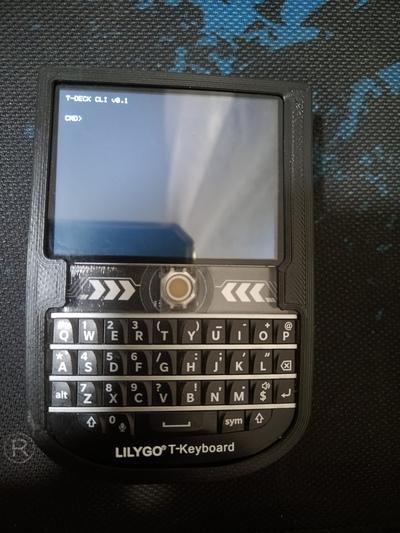
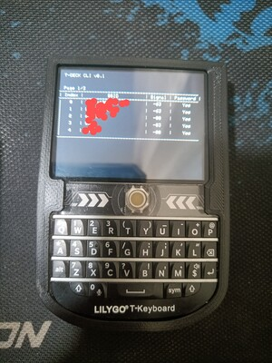
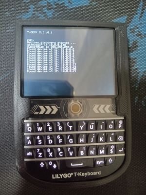

<p align="center">
  
</p>

<p align="center">
  <a href="https://github.com/abdallahnatsheh/AL-ANQA-FIRMWARE/actions/workflows/build.yml"></a>
  
  
  
  
</p>

<p align="center">
  <b>Offensive security firmware for the LilyGo T-Deck — a pentesting terminal in your pocket.</b><br/>
  <a href="https://abdallahnatsheh.github.io/AL-ANQA-FIRMWARE"><b>📖 Documentation</b></a>
</p>

---

> **⚠️ Legal**
> For **authorized security testing, CTF competitions, and education only.** Using these
> tools against networks or devices you do not own or have **written permission** to test is
> illegal. You are responsible for how you use it.

---

## Overview

Al-Anqa turns the LilyGo T-Deck (ESP32-S3) into a self-contained offensive-security terminal:
a blinking cursor, a physical keyboard, and 60+ WiFi / Bluetooth / network / radio tools —
no PC, no app, no GUI. Everything runs on-device and logs to the SD card.

Two boards are supported: **T-Deck** and **T-Deck Plus** (adds GPS and a speaker for
wardriving and audio tools). The project is under **active development**.

---

## Features

### 📡 WiFi &nbsp;·&nbsp; [guide](docs/wifi-attacks.md)
- Scan, connect, and a full WiFi manager (radio on/off, forget networks)
- Monitor mode — APs + clients views, targeted deauth, raw PCAP capture (Wireshark-compatible), passive probe logger
- Evil Twin captive portal, hidden-SSID reveal, MAC spoofing, WPS detection
- WPA/WPA2 handshake **and** PMKID capture with **on-device cracking**; offline `.cap` cracker
- WPA3 transition-mode downgrade, Karma rogue-AP suite, beacon flood
- Wardriving → WiGLE 1.4 CSV (Plus), passive WiFi IDS (`wguard`), WiFi-CSI motion detection

### 🌐 Network &nbsp;·&nbsp; [guide](docs/network.md)
- ARP host discovery, parallel TCP port scan, ICMP ping, banner grab + OS fingerprinting
- Interactive **SSH client** (libssh) — PTY shell, 16-colour terminal, trackball scrollback
- **Client-isolation recon** (`netspy`) and **active isolation audit** (`isoscan`) — implements the AirSnitch technique to reach and enumerate "isolated" clients on your own network

### 🔵 Bluetooth LE &nbsp;·&nbsp; [guide](docs/bluetooth.md)
- Device scanner and **GATT enumeration** — read/write/fuzz characteristics, notify/indicate sniffing, and a full **security audit** of a target device:
  - **`[b]` audit** — link posture: encrypted? Just Works vs MITM? bonded? counts of chars readable/writable without pairing, plus a secret-value leak scan (keys/PINs)
  - **`[g]` abuse** — access-control read-hammer: reads *every* characteristic ignoring its Read flag; a char that leaks data it marked non-readable = broken server-side access control
  - **`[f]` fuzz** — writable-char fuzzer: sequential / random / boundary bytes, plus **oversized** (past-MTU long writes → input-length validation) and **flood** (unthrottled writes → DoS / rate-limit resistance)
- **Anti-tracking detector** — flags AirTag, Tile, Samsung SmartTag, Chipolo, Pebblebee and Google Find My tags by service-UUID (verified against AirGuard)
- Fast Pair attack, notification spam (Apple / Android / Microsoft / Samsung), passive advertisement sniffer, MAC-watchlist proximity alerts
- BLE HID **keyboard + mouse**, and a Claude Desktop **buddy** remote (approve prompts from the T-Deck)

### 📻 ESP-NOW Radio &nbsp;·&nbsp; [guide](docs/espnow.md)
- Off-grid **encrypted chat** (AES-128), **HD voice walkie-talkie** (G.722 wideband), frame sniffer and diagnostic — no router, no association

### 🔌 USB & HID &nbsp;·&nbsp; [guide](docs/usb.md)
- Mass storage (SD as a USB drive), USB keyboard + mouse, mouse jiggler
- **BadUSB / DuckyScript** over USB **or BLE** (`ux ble`) — clone/spoof a bonded device, live-scanning target picker with in-place GATT inspection

### 🔑 Credentials & Storage &nbsp;·&nbsp; [guide](docs/wifi-credentials.md)
- Saved WiFi credential manager, bidirectional Linux `wpa_supplicant.conf` sync
- On-device SD file manager — `ls` / `cd` / `cat` / `edit` (nano-style) / `rm`

### 🖥️ System & Opsec &nbsp;·&nbsp; [guide](docs/system.md)
- On-device man pages, autocomplete, command history, power save
- **Lock screen** — SHA-256 PIN or no-PIN mode, idle auto-lock, hold-to-lock
- **Undercover mode** — a silent phone home-screen disguise with a secret exit passphrase and a panic key; live weather via Open-Meteo (keyless)
- **NES emulator** (`gm`) — play legal/homebrew `.nes` ROMs (mappers 0–4+069) with a retro library picker, save states, and trackball/keyboard controls

---

## Hardware

| Component | Details |
|-----------|---------|
| Devices | LilyGo T-Deck · LilyGo T-Deck Plus |
| MCU | ESP32-S3 · 16 MB flash · 8 MB PSRAM |
| Display | 320×240 ST7789 TFT (GT911 capacitive touch) |
| Input | Physical QWERTY keyboard (I2C) + trackball |
| Radio | WiFi 2.4 GHz · Bluetooth LE (NimBLE) · LoRa SX1262 |
| GPS | L76K / u-blox M10Q — **T-Deck Plus only** |
| Audio | ES7210 mic + I2S speaker — **T-Deck Plus** |

---

## Build & Flash

**Requirements:** [VS Code](https://code.visualstudio.com/) + the [PlatformIO](https://platformio.org/) extension.

```bash
git clone https://github.com/abdallahnatsheh/AL-ANQA-FIRMWARE
# Open in VS Code → pick env:T-Deck or env:T-Deck-Plus → Upload
```

> **Can't upload?** Hold the trackball button, plug in USB, then release — this forces the ESP32-S3 into download mode.

---

## Command Reference

Run `help` for the list on-device, or `man <cmd>` for a full manual page.

| Command | Short | Args | Description |
|---------|-------|------|-------------|
| `help` | `hlp` | `[cmd]` | List commands, or detail one |
| `man` | `mn` | `<cmd>` | On-device manual page |
| `info` | `inf` | — | Device info (chip, MACs, battery, SD) + project GitHub QR |
| `show` | `sh` | `<wifi\|ble\|hosts>` | Re-display the last scan |
| `clear` | `clr` | — | Clear screen |
| `pwrsave` | `psv` | `[status\|on\|off\|set ...]` | Power-save config (dim / screen-off on idle) |
| `sleep` | `slp` | — | Deep sleep (~240 µA); click trackball to wake |
| `lock` | `lk` | `[new\|update\|clean\|timeout <s>\|status]` | Screen lock — optional SHA-256 PIN |
| `volume` | `vol` | `[0-100\|up\|down\|off]` | Master audio volume |
| `notif` | `nf` | `[on\|off\|vol <n>\|test\|<lvl> ...]` | Notification manager (per-level, custom WAV) |
| `tz` | `tz` | `[+HH:MM\|<posix>\|status]` | Device timezone (persisted) |
| `weather` | `wx` | `[loc <lat> <lon>\|units ...\|now]` | Live weather (Open-Meteo, **no API key**) |
| `home` | `hm` | `[EXP]` | Home-launcher cover UI (standalone) |
| `undercover` | `uc` | `[set\|clear\|status\|boot ...\|panic ...]` | **[EXP]** Silent disguise — passphrase exit, panic key |
| `game` | `gm` | `[<rom.nes>]` | **[EXP]** NES emulator — Anemoia core (mappers 0–4+069), ROM library, save states |
| **WiFi** | | | |
| `scanwifi` | `sw` | `[on\|off]` | WiFi manager — scan / connect / forget / radio power |
| `connectwifi` | `cw` | `<index\|ssid>` | Connect by scan index or SSID |
| `wifipass` | `wp` | `[export\|clear]` | Saved WiFi creds — view / export / erase |
| `wifimon` | `wm` | `[ch]` | Monitor mode — APs + clients, `[d]` deauth, `[s]` PCAP, `[p]` probe log |
| `deauth` | `da` | `<bssid\|#> [ch] [client]` | Deauthentication attack |
| `eviltwin` | `et` | — | Evil Twin AP + captive portal |
| `hiddenssid` | `hs` | `<idx\|bssid> [ch] [silent]` | Reveal a hidden SSID |
| `macchanger` | `mc` | `on\|off\|random\|set <mac>` | Spoof the STA MAC |
| `wpasniff` | `ws` | `<idx\|bssid> [ch]` | Capture + crack a WPA2 handshake |
| `pmkid` | `pm` | `<idx\|bssid> [ch]` | PMKID capture + crack — passive, no client |
| `wpa3down` | `w3d` | `[probe] [auto] [idx] [mac]` | **[EXP]** WPA3 transition downgrade → crackable `.cap`; auto-discovers the AP's clients (no MAC typing) + empirical PMF probe |
| `karma` | `km` | `[auto\|hs\|portal <ssid>]` | Rogue-AP suite — harvest, PNL fingerprint, half-handshake, portal |
| `crack` | `cc` | `[cap] [wordlist\|dir]` | Offline WPA/WPA2 crack (handshake or PMKID) |
| `wguard` | `wg` | `<idx\|bssid> [ch] [bg]` | Passive WiFi IDS; `wg stop` / `wg view` |
| `beaconflood` | `bf` | `[list\|rickroll\|seq <base>\|file\|clone]` | Beacon flood — fake AP injection |
| `wps` | `wps` | `[<idx>]` | All-in-one WPS: IE decode + device leak + PIN calc + live EAP-WSC handshake sniff (→ pixiewps) + `[p]` push-button |
| `wardrive` | `wd` | — | Wardriving → WiGLE 1.4 CSV (**Plus only**) |
| `espsniff` | `es` | `[ch]` | Passive ESP-NOW sniffer — CSV + PCAP |
| `esptest` | `est` | `[ch]` | ESP-NOW TX/RX diagnostic |
| `espchat` | `ec` | `[pub\|prv\|bg\|stop] [ch]` | Off-grid ESP-NOW chat (AES-128 private mode) |
| `espvoice` | `ev` | `[ch]` | ESP-NOW walkie-talkie — G.722 HD voice |
| **Network** | | | |
| `netdiscover` | `nd` | — | ARP scan of the local /24 |
| `netspy` | `ns` | `[gtk\|dump]` | **[EXP]** Passive client-isolation device recon (AirSnitch) |
| `isoscan` | `is` | `[ns#] <attack>` · `cctest` | **[EXP]** Active isolation audit — **transmits**; `auto` recommends an attack |
| `arpspoof` | `as` | `<victim> [gw]` | ARP poisoning + logs what the victim reaches (dst IP/DNS/HTTP → SD); heals on exit |
| `responder` | `rsp` | `[passive]` | **[EXP]** LLMNR/NBT/mDNS poisoner + NetNTLMv2/v1 + Basic capture (HTTP & SMB); `passive` = listen-only → per-session SD folder |
| `portscan` | `ps` | `<ip\|#\|ns#> <start> <end>` · `top ...` | TCP port scan (`top` = 26 common ports) |
| `ping` | `pg` | `<ip\|host\|#\|ns#>` | Continuous ICMP ping with RTT stats |
| `dpwo` | `dw` | `<ip\|nd#\|ns#> [svc\|port\|svc:port]` | Default-password check (FTP/SSH/Telnet/HTTP/RTSP/Redis/MQTT/SNMP); `svc` = quiet single-service, `svc:port` = custom port (e.g. `ssh:2222`) → `/apps/dpwo/results.csv` |
| `ssh` | `sc` | `<ip\|name> [user]` | Interactive SSH client (libssh) + saved profiles |
| **Bluetooth** | | | |
| `scanblue` | `sbl` | — | BLE device scan |
| `bleinfo` | `bi` | `<index\|mac\|all>` | GATT enum — read/write/`[f]`fuzz(seq/rand/boundary/oversized/flood)/sniff/pair + `[b]`audit + `[g]`abuse read-hammer |
| `trackme` | `tm` | `[silent]` | Anti-tracking detector |
| `fastpair` | `fp` | `[scan\|spam\|h <idx>\|h all]` | Fast Pair — scan / flood / GATT hijack |
| `blespam` | `bs` | `[apple\|android\|ms\|samsung\|all]` | BLE notification spam |
| `bmon` | `bm` | — | Passive BLE advertisement sniffer (iBeacon/Eddystone, PCAP) |
| `macwatch` | `mw` | `[bg]` | WiFi+BLE MAC watchlist → proximity alerts |
| `buddy` | `bd` | `[name]` | Claude Desktop remote — approve prompts, ASCII pet |
| `btkbd` | `bk` | — | T-Deck as a BLE keyboard + mouse (MITM-bonded) |
| **SD Card** | | | |
| `sdinfo` | `sdi` | — | SD card info |
| `sdls` | `ls` | `[path]` | List directory (paginated) |
| `cd` | `cd` | `<dir\|..>` | Change working directory |
| `cat` | `cat` | `<path>` | Scrollable file viewer |
| `edit` | `ed` | `<path>` | nano-style text editor |
| `rm` | `rm` | `<path>` | Delete file; `rm -d <dir>` recurses |
| `sdformat` | `sdf` | `[init]` | Format SD to FAT32 |
| **USB / HID** | | | |
| `usbmsc` | `um` | — | Expose the SD card as USB mass storage |
| `usbkbd` | `uk` | — | T-Deck as a USB keyboard + mouse |
| `jiggle` | `jg` | `[ble]` | Mouse jiggler (USB or BLE) |
| `usbexec` | `ux` | `[auto\|remote\|ble [clone <mac\|#>]] demo\|<path>` | BadUSB DuckyScript over USB or BLE (`ux ble`); `ux auto` OS-detect, `ux remote` SoftAP web trigger |
| **Diagnostics** | | | |
| `gps` | `gps` | `on\|off\|test` | GPS control + coordinate test (Plus) |
| `test` | `tst` | `<spk\|mic\|lora\|touch>` | Hardware self-tests |
| `i2cscan` | `isc` | `[r\|raw\|w\|d ...]` | **[EXP]** Interactive I2C bus scanner |
| `csidetect` | `csi` | `[auto]` | **[EXP]** WiFi-CSI motion detector (energy only, no direction) |
| `MATRIX` | `matrix` | — | Matrix rain animation |

> **Tip:** run `nd` (or `ns`) first, then use the host index in `ps` / `pg` instead of typing the IP.

---

## Keyboard & Navigation

All scan tables share `l` / `a` (next / previous page), `u` (rescan), `q` (quit).

| Trackball (command line) | Action |
|--------------------------|--------|
| Left / Right | Move cursor within the command |
| Up / Down | Command history (16 entries) |
| Click | Execute |
| Double-click | Screen off / on |
| Hold 3 s | Lock screen (from anywhere) |

- **Backspace hold** (1.5 s) → auto-delete at ~16 chars/s; any key stops it.
- **Autocomplete** — press `'` (Sym+K): completes command names at the start, file/dir paths after file commands, and valid sub-arguments (shown in yellow).

See the [keyboard reference](docs/keyboard.md) for the full mapping.

---

## SD Card Layout

```
/wpa_supplicant.conf       saved WiFi credentials (Linux-compatible)
/config/                   device-wide settings (pwrsave, lock, notif, weather, undercover…)
/config/notification/      per-level alert WAVs (16-bit PCM, 22050 Hz, mono)
/apps/<tool>/              one self-contained folder per command — logs, captures, wordlists, config
/apps/notes/               undercover Notes cover files
/apps/nes/roms/            NES ROMs (.nes) for the `gm` emulator
/apps/nes/states/          NES save states (one per ROM, keyed by CRC32)
```

Each tool writes under its own `/apps/<tool>/` folder (e.g. `wpasniff/`, `eviltwin/`,
`karma/`, `wardrive/`, `bleinfo/`, `badusb/scripts/`). See the [SD Card guide](docs/sdcard.md)
for the complete file reference.

---

## Dependencies

Installed automatically via PlatformIO `lib_deps`:

**LovyanGFX** (display) · **NimBLE-Arduino** (BLE) · **RadioLib** (LoRa) ·
**LibSSH-ESP32** (SSH) · **SensorLib** (GT911 touch) · **ESP32Ping** · **AceButton** ·
**ArduinoJson** · **TinyGPSPlus** · **TP_Arduino_DigitalRain_Anim** · **18650CL** (battery)

Vendored under `lib/`: **libg722** (voice codec) · **ES7210** (mic driver).

---

## Documentation

Full docs — every command, workflows, keyboard reference, troubleshooting, and the
`wguard` / `trackme` algorithm write-ups — are published at
**[abdallahnatsheh.github.io/AL-ANQA-FIRMWARE](https://abdallahnatsheh.github.io/AL-ANQA-FIRMWARE)**
(source in [`docs/`](docs/)).

---

## Screenshots

| Main Screen | WiFi Scanner | Network Scan |
|-------------|--------------|--------------|
|  |  |  |

---

## Contributing

Issues and PRs are welcome. To add a command or module:

1. Open an issue describing the feature.
2. Fork and branch.
3. Implement (new modules get their own `.cpp/.h`; register the command in `setupCommands()`).
4. Submit a PR referencing the issue.

CI compiles both `T-Deck` and `T-Deck-Plus` on every push.

---

## License

Released under the **[GNU AGPL-3.0](LICENSE)**. If you run a modified version as a network
service, you must make your source available under the same license.

---

## Credits

- [Bruce Firmware](https://github.com/pr3y/Bruce) — reference and adapted components (AGPL-3.0)
- [LilyGo T-Deck](https://github.com/Xinyuan-LilyGO/T-Deck) — hardware and example code
- [AirGuard](https://github.com/seemoo-lab/AirGuard) — anti-tracking research (TU Darmstadt)
- AirSnitch (Vanhoef, NDSS 2026) — client-isolation bypass technique
- [Anemoia-ESP32](https://github.com/Shim06/Anemoia-ESP32) — vendored NES emulator core (GPL-3.0, © Shim06)

<p align="center"><sub>Built for the LilyGo T-Deck · ESP32-S3 · AGPL-3.0</sub></p>
