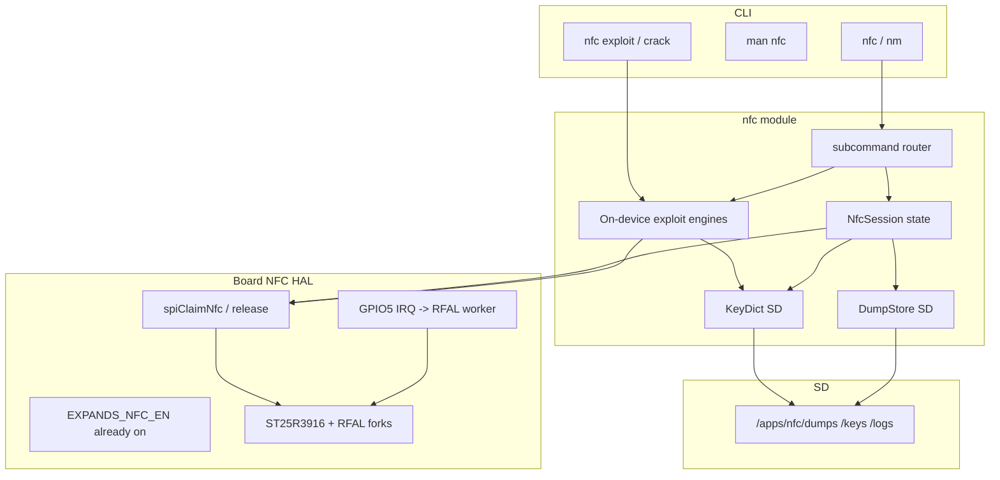

# AL-ANQA Ultimate NFC Field Toolkit (T-Pager)

**Status:** PLAN ONLY — no firmware implementation until an explicit “implement / build” ask.  
**Branch policy:** stay on `feature/pentest-enhancements`; never merge to `main` without ask.  
**User builds/flashes:** no `pio` unless requested.  
**Locked choices:**
- ~~**1B — CLI-first:**~~ **1B REVISED 2026-08-30 → Interactive-app-first**: bare `nfc` opens a full-screen live app (like `wm`/`bmon`/`netspy`/`wg`) with continuous polling + action shortcuts (`[d]`ump `[w]`rite `[e]`mu `[i]`nfo `[s]`cene `[q]`uit). CLI subcommands (`nfc info` / `nfc scan`) stay as one-shot shortcuts for pipelines/scripting — same pattern as `sw` vs `wm`.
- **2C — Ship Flipper-HF field tool first; lab-depth as Phase 2+** in the same roadmap.
- **3D — On-device exploits:** attack engines run **on the T‑Pager** so lab tests need no laptop. PC export remains a *fallback / speed-up*, not the primary path.

**Thesis:** Proof that an ESP32-S3 + ST25R3916 can be a pocket HF security instrument — Flipper-class in the field, with a clear path toward Proxmark-*HF* lab depth (not LF, not a Proxmark replacement).

---

## 1. Hardware truth (T-Pager)

| Item | Value | Source |
|------|--------|--------|
| NFC IC | **ST25R3916** (SPI) | [LilyGo wiki](https://wiki.lilygo.cc/products/t-lora-series/t-lora-pager/), [ST product page](https://www.st.com/en/nfc/st25r3916.html) |
| CS | **GPIO39** (`BOARD_NFC_CS`) | pins + wiki |
| IRQ | **GPIO5** (`BOARD_NFC_IRQ`) | Confirmed: [arduino-esp32 `pins_arduino.h`](https://github.com/espressif/arduino-esp32/blob/master/variants/lilygo_tlora_pager/pins_arduino.h) `NFC_INT (5)`, LilyGo MicroPython hardware doc. **Quick Start `BOARD_NFC_INT 1` is wrong** (GPIO1 = `RTC_INT`). Our [tpager/pins.h](al-anqa-firmware/core/board/tpager/pins.h) already has IRQ=5 — keep it. |
| Power | **XL9555 `EXPANDS_NFC_EN` = 5** | Must be HIGH before RFAL init (already in `boardPowerOn()` rail list) |
| SPI bus | Shared with **display + SD + LoRa** (MOSI34/MISO33/SCK35) | Deassert **all** other CS before NFC ops |
| Band | **HF 13.56 MHz only** | No LF 125 kHz antenna/silicon → no EM4100/HID Prox/Indala/T5577 |

### SPI / GDMA discipline (load-bearing)

Before every NFC SPI burst:

1. `flushSPI()` / LGFX DMA drain (existing AL-ANQA rule).
2. Drive HIGH: display CS, SD CS (`BOARD_SDCARD_CS`), LoRa CS (`RADIO_CS_PIN`), then assert NFC CS only for the transaction.
3. Mirror the inverse in [sdcard_manager.cpp](al-anqa-firmware/hardware/sdcard/sdcard_manager.cpp) (already deasserts NFC CS before SD).
4. Never run NFC while Wi‑Fi is in promiscuous/APSTA without the same coexistence caution used for SD (pause or serialize).

### Capability flag

Add to [board.h](al-anqa-firmware/core/board/board.h) (T-Pager only):

```c
#define BOARD_HAS_NFC  1   // ST25R3916
```

Gate command registration, libs, and man pages on `BOARD_HAS_NFC`. T-Deck/T-Deck-Plus stay byte-identical (no NFC silicon).

---

## 2. What ST25R3916 can vs cannot do

Chip modes ([ST datasheet summary](https://www.st.com/en/nfc/st25r3916.html), [HydraNFC v2](https://hydrabus.com/hydranfc-shield-v2-specifications/)):

| Mode | Hardware | Notes |
|------|----------|--------|
| Reader/writer NFC-A/B/F/V | Native | ISO14443A/B, FeliCa, ISO15693 |
| Card emulation NFC-A / NFC-F | Native + active load modulation | Type 4 / MFC need host stack |
| P2P initiator/target | Native | Lower priority for AL-ANQA |
| Low-level / transparent / stream | Yes | Path for MIFARE Classic framing |
| LF 125 kHz | **No** | Proxmark/Flipper LF only |
| FPGA-grade dual-sniff | **No** | Proxmark `hf 14a sniff` class stays Proxmark; HydraNFC has experimental sniffer work — stretch goal only |

**Same HF front-end as Flipper Zero** ([Flipper NFC docs](https://docs.flipper.net/zero/nfc)) — so Flipper’s *HF* feature set is the right ambition ceiling for Phase 1–2, not Proxmark’s full dual-band lab suite.

---

## 3. OSS map — what to learn from (with links)

### Primary (same silicon)

| Project | Why it matters | Link |
|---------|----------------|------|
| **Flipper Zero NFC app** | UX + feature checklist on ST25R3916: read/save/emulate, MF keys, detect reader | [docs](https://docs.flipper.net/zero/nfc), [source](https://github.com/flipperdevices/flipperzero-firmware/tree/dev/applications/main/nfc) |
| **Flipper NFC theory** | Clear HF vs LF split; Crypto1 / nested / MFKey32 explained | [nfc-theory.md](https://github.com/pogorelov-labs/flipper-ble-mcp/blob/main/cards/nfc-theory.md) |
| **ST RFAL + ST25R3916 driver** | Official middleware LilyGo already vendors forks of | [ST25R3916](https://www.st.com/en/nfc/st25r3916.html), LilyGo [ST25R3916-fork](https://github.com/lewisxhe/ST25R3916-fork), [NFC-RFAL-fork](https://github.com/lewisxhe/NFC-RFAL-fork) |
| **HydraNFC Shield v2 + HydraFW** | Research-oriented ST25R3916: RW, CE, P2P, low-level, experimental sniff | [specs](https://hydrabus.com/hydranfc-shield-v2-specifications/), [hydrafw_hydranfc_shield_v2](https://github.com/hydrabus/hydrafw_hydranfc_shield_v2) |
| **Bruce RFID / Tag-O-Matic** | ESP32 field UX; ST25R3916 preferred for emulate; PN532 limits documented | [Bruce wiki RFID](https://wiki.bruce.computer/features/rfid/), [DeepWiki](https://deepwiki.com/pr3y/Bruce/7-rfid-features), [firmware](https://github.com/BruceDevices/firmware) |

### MIFARE Classic / keys

| Project | Why | Link |
|---------|-----|------|
| **Proxmark3 RRG** | Gold standard HF attacks (`hf mf chk/nested/hardnested/autopwn`); define Phase 2 targets + honesty about ESP32 CPU time | [RfidResearchGroup/proxmark3](https://github.com/RfidResearchGroup/proxmark3) |
| **MFKey32v2** | Offline key recovery from reader nonces (Flipper “Detect Reader” flow) | [equipter/mfkey32v2](https://github.com/equipter/mfkey32v2) |
| **mfkey_desktop_cli** | Auto detect mfkey32 / static_nested / static_encrypted logs | [phntm-lab/mfkey_desktop_cli](https://github.com/phntm-lab/mfkey_desktop_cli) |
| **Flipper MFC wiki** | Practical dump → emulate → magic-card fallback | [flipper.wiki/mifareclassic](http://flipper.wiki/mifareclassic/) |

### PN532 / ESP32 toolkits (patterns, not drivers)

| Project | Steal ideas, not the PN532 HAL | Link |
|---------|--------------------------------|------|
| **cypher-pn532** | ESP32-C3 + PN532 field workstation: type detect, full MFC/NTAG dump, dict attack, magic clone, NDEF, Type‑4 NDEF emu, SD artifacts, USB/BLE CLI — **steal workflow, not PN532 HAL** (explicitly cannot do sniff / full MFC emulate / LF) | [dkyazzentwatwa/cypher-pn532](https://github.com/dkyazzentwatwa/cypher-pn532) |
| **NullTag (CiferTech)** | Custom ESP32+PN532 research handheld; read/clone/dump UX lessons | [NullTag rebuild writeup](https://cifertech.net/i-built-an-rfid-disruptor-confuses-readers-destroys-tags/) |
| **PN532Killer + MFKey** | Reader sniff / mfkey without original-tag workflows (hardware differ; flow maps to our `nfc reader`) | [pn532killer mfkey tutorial](https://pn532killer.com/tutorial/how-to-use-mfkey32) |
| **LilyGo `examples/NFC`** | Board-specific RFAL bring-up on T-LoRa Pager (PlatformIO `src_dir = examples/NFC`) | [Quick Start](https://wiki.lilygo.cc/products/t-lora-series/t-lora-pager/quick-start.html) + LilyGoLib-PlatformIO |

### Interop formats

- Prefer **Flipper File Format (FFF) `.nfc`** for dumps where practical → interchange with Flipper / community tools.
- Also support raw **`.mfc` / sector hex** and Proxmark-ish dump export later.
- Key dict: Flipper-style `mf_classic_dict.nfc` + user dict on SD.

---

## 4. Public vulnerability research & lab cards

**Honest status (pre–this pass):** §3 covered Flipper / Proxmark / MFKey *tooling*, but **not** a systematic vuln catalog or a **buy-these-cards** lab kit. This section fills that gap from public research + GitHub (authorized lab / own tags only).

**Product rule:** AL‑ANQA implements **fingerprint → classify → exploit on-device → dump/report**. We port the research community’s **open, known** attack engines into firmware so you can **test every XT-* from the pager itself** (owned lab tags) + **vuln cards** in `nfc info` / `nfc case`. PC tools are optional accelerators, not required for a PASS.

**Scope of “exploit for testing”:** exercise public Crypto1 / nested / mfkey / darkside / static-enc / magic-clone / relay paths on **blank, magic, and research silicon you own**, **end-to-end on device** wherever CPU/RAM allows. Same flows later support authorized engagement work; plan and default docs assume lab kit first.

### 4.1 Vulnerability matrix (what we can actually exercise on ST25R3916)

| Class | Cards / chips | Public research | GitHub / tooling | Our phase | **On-device exploit (locked)** |
|-------|---------------|-----------------|------------------|-----------|--------------------------------|
| **Default / weak keys** | MFC 1K/4K with factory or hotel dict keys | Ancient; still #1 field hit | Flipper `mf_classic_dict.nfc`, Proxmark `hf mf chk` | **1** | **Full** — dict chk + dump on pager |
| **Crypto1 mfkey32 / Moebius** | Any MFC when you can sniff reader↔tag auth | Classic Crypto1 papers | mfkey32v2, Flipper MFKey FAP, crapto1 | **1b** | **Full** — capture **and crack on device** (Flipper-class; S3 + PSRAM OK) |
| **Nested (weak PRNG)** | Older MFC with weak PRNG | Nested attack literature | Flipper PR #3822, Proxmark nested | **2** | **Full** — collect + recover keys on device |
| **Hardnested (hardened PRNG)** | MFC with hard PRNG | Garcia / Proxmark hardnested | HardnestedRecovery, Proxmark | **2** | **Best-effort on device** — background task + ETA + `q` cancel; may take long; optional PC export if user aborts |
| **Darkside** | MFC with NACK bug | Darkside paper | Proxmark `hf mf darkside` | **2** | **Full** on device when NACK present |
| **Static nested** | Predictable nested PRNG | Community / mfkey CLI | static_nested | **2** | **Full** on device |
| **Static encrypted nonce + Fudan backdoors** | FM11RF08S / FM11RF08 / … | ePrint 2024/1275 | Proxmark `isen` / `fm11rf08s_recovery` | **2–3** | **Target: full on device** — port recovery steps after detect; until port complete: detect + progress UI + keys import still works |
| **UL-C / UL-AES / NTAG DNA (PKO)** | UL-C / DNA / counterfeits | ePrint 2026/100 | mfulc_des_brute | **3** | **Partial** — protocol/oracle on device; heavy 2²⁸ brute may need long S3 run or optional PC |
| **ISO14443 relay** | Lab APDU HF | Mendoza / IOActive | dual pager | **2–3** | **Full** — two devices, no PC |
| **NDEF / Type‑4 misconfig** | NTAG / unlocked T4 | Config mistakes | NDEF R/W | **1** | **Full** |
| **DESFire EV1–3** | Own blank + known keys | — | DEScent / Proxmark | **3** | **Full** known-key ops only |
| **FeliCa / ISO15693** | ID / R/W | — | RFAL | **1** / **3** | Identify / basic R/W |
| **LF 125 kHz** | — | — | — | — | **Impossible** |

### 4.2 `nfc vuln` / fingerprint cards (AL‑ANQA touch)

Flipper shows type; **we show a vuln card** after every scan (CLI table + optional case attachment):

```
UID 04:A1:...  MFC 1K  Fudan FM11RF08S
PRNG hard | static_enc_nonce YES | NACK no
VULN CARDS:
  [!] BD-08S   hardware backdoor path (2024/1275) — use Proxmark recovery / PC
  [!] SE-NEST  static encrypted nonces — nested/hardnested N/A
  [ ] DICT     try dict (often diversified)
RECOMMEND: nfc exploit run XT-MFKEY | nfc exploit run XT-08S
```

Implement as a small **rules table** (UID BCC / ATQA/SAK / manufacturer bytes / PRNG probes), not a hard-coded exploit blob. Signature win: **assessment language**, not gadget language.

CLI sketch: `nfc info` always prints cards · `nfc vuln list` · `nfc vuln show <id>` · attach to `nfc case`.

### 4.3 GitHub / paper backlog to track (beyond §3)

| Item | Why |
|------|-----|
| Flipper NFC key-recovery PR [#3822](https://github.com/flipperdevices/flipperzero-firmware/pull/3822) | Nested + static encrypted on same silicon class |
| [noproto/HardnestedRecovery](https://github.com/noproto/HardnestedRecovery) | PC path for our `.nested.log` |
| Proxmark3 `fm11rf08s_recovery` / `hf mf isen` | Gold standard for 2024/1275 |
| ChameleonUltra `mfulc_des_brute` + Proxmark UL-C scripts | 2026/100 follow-on |
| [RfidResearchGroup/proxmark3](https://github.com/RfidResearchGroup/proxmark3) `doc/magic_cards_notes.md` | Magic Gen1–4 command truth |
| Lab401 [Know your magic cards](https://lab401.com/blogs/academy/know-your-magic-cards) | Buy matrix |
| Flipper [magic-cards docs](https://docs.flipper.net/zero/nfc/magic-cards) | Write UX checklist |

### 4.4 Physical lab kit — cards to buy / keep in the case

**Purpose:** own tags only, so every attack path is testable without touching production badges.

| Card | Qty | Tests which path |
|------|-----|------------------|
| **Blank MFC 1K** (NXP or known Fudan) with **default keys** | 2–3 | Dict dump, NDEF-less MFC, `nfc auto` |
| **MFC 1K with diversified / unknown keys** (self-written) | 1–2 | Dict miss → reader/mfkey / nested path |
| **FM11RF08S** sample (“static enc nonce” / hardened Fudan) | **≥1** | On-device XT-08S detect + recovery |
| **FM11RF08** (older Fudan) | 1 | On-device XT-08 |
| **NTAG213 / 215** blanks | 2 | NDEF R/W, emulate, scene |
| **MIFARE Ultralight C** (genuine NXP) | 1 | UL-C auth / Phase 3 PKO research honesty |
| **Counterfeit UL-C** (GT23 / Feiju / USCUID-UL if obtainable) | 1 | 2026/100 counterfeit recovery class |
| **Magic Gen1a** (UID changeable MFC 1K) | 3+ | Clone write path Phase 1 |
| **Magic Gen4 Ultimate** | 1–2 | Multi-type write / ATQA-SAK tune; picky-reader fallback |
| **Magic Gen2 CUID** (optional) | 1 | Document “Android MCT / limited Flipper” — support if easy |
| **ISO15693 / ICODE** blank | 1 | NFC-V scan path |
| **DESFire EV1/EV2** blank (own keys) | 1 | Phase 3 enumerate / known-key only |
| **Lab “reader”** | phone MCT / ACR122U / second pager | Detect Reader + relay mule/proxy |

**Do not buy for this project:** payment instrument samples, client production badges, anything you don’t own. Lab kit = blanks + magic + known research silicon.

### 4.5 Lab exploitation for testing — **exploits live on the device**

**User requirement (locked):** do not stop at “capture here, crack on PC.” Port the **exploit engines into NFC firmware** so `nfc exploit run XT-*` completes **on the T‑Pager** for lab testing.

#### On-device exploit engine (firmware modules)

```
nfc/
  exploit/
    nfc_exploit_runner.cpp   # XT-* state machines, progress, confirm prompts
    crapto1/                 # vendored/adapted Crypto1 (Proxmark/Flipper lineage)
    nfc_atk_dict.cpp         # dictionary / chk
    nfc_atk_mfkey.cpp        # mfkey32 + Moebius (on-device crack)
    nfc_atk_nested.cpp       # nested + static_nested
    nfc_atk_hardnested.cpp   # hardnested (long-running FreeRTOS task)
    nfc_atk_darkside.cpp     # darkside when NACK
    nfc_atk_static_enc.cpp   # FM11RF08S / static encrypted recovery (phase 2–3)
    nfc_atk_magic.cpp        # Gen1a / Gen4 write
    nfc_atk_relay.cpp        # mule/proxy (dual device)
```

**Runtime rules:**

- Exploits run on a **dedicated FreeRTOS task** (priority below UI/CLI input) so keyboard `q` can cancel.
- Use **PSRAM** for nonce buffers / hardnested tables; never blow internal DRAM.
- Progress on CLI: `mfkey 62% | key? … | ETA ~40s` / haptic tick on key found.
- On success: auto-merge key → user dict on SD → offer `dump` immediately — **no laptop**.
- Optional: `nfc exploit run XT-MFKEY --export` still writes `.mfkey32.log` for PC if user wants speed.

#### XT matrix (on-device primary)

| Test ID | Vuln / technique | Lab setup | **On-device exploit flow** | Pass criteria |
|---------|------------------|-----------|---------------------------|---------------|
| **XT-DICT** | Default / weak keys | Blank MFC default keys | `nfc exploit run XT-DICT` → chk+dump | Full dump on SD |
| **XT-AUTO** | Pipeline | Same | `nfc auto` / `XT-AUTO` | Dump+geotag (+scene opt) |
| **XT-MAGIC** | Clone | Dump + Gen1a/Gen4 | magic check+write on device | Lab reader accepts clone |
| **XT-EMU** | Soft emulate | Complete dump | `nfc emu` on device | Reader sees tag |
| **XT-NDEF** | Open NDEF | NTAG blank | ndef R/W on device | Round-trip |
| **XT-MFKEY** | mfkey32 | Diversified MFC + lab reader | `nfc reader` capture → **`nfc crack` / engine cracks on S3** → dict add → dump | Key found **on pager**; dump completes |
| **XT-NEST** | Nested weak PRNG | Owned card + 1 known key | nested collect + **on-device recover** → dump | Rest of sectors open **without PC** |
| **XT-HN** | Hardnested | Hard PRNG + 1 known key | hardnested task on device (minutes–hours OK) + cancel; `--export` if abort | Key on device **or** documented export after cancel (still try on-device first) |
| **XT-DARK** | Darkside | NACK card | darkside engine on device | Key or honest “no NACK” |
| **XT-08S** | FM11RF08S / static enc | Owned 08S | detect + **on-device recovery port** → dump | Keys+dump on pager (PC only if port WIP) |
| **XT-08** | Legacy Fudan backdoor class | Owned FM11RF08 | same, older card id | Detect+recover+dump on device |
| **XT-RELAY** | Relay | Two pagers | mule+proxy on devices | Timing HUD; lab success/fail-closed |
| **XT-ULC** | UL-C / 2026/100 | UL-C samples | oracle/capture on device; brute on S3 if feasible | Detect; recover when public math fits |
| **XT-DF** | DESFire known-key | Own DESFire | enumerate+auth on device | AID/files listed |
| **XT-SCENE** | Packaging | Any | scene+case+vuln attach | Case artifacts on SD |

**Operator UX:**

```
nfc exploit list                 → XT-* | phase | engine | last PASS/FAIL | on-device?
nfc exploit run XT-DICT          → full attack on device, prompts for card
nfc exploit run XT-MFKEY         → capture + crack HERE (progress %)
nfc exploit run XT-HN            → long job; shows ETA; q cancels → optional export
nfc exploit run XT-08S           → fingerprint + recovery engine on device
nfc crack [log]                  → alias: run mfkey/static engines on last/named log
nfc exploit report               → /apps/nfc/cases/lab-matrix.md
```

**Firmware test matrix (manual CI):** Phase exit = XT-* **PASS on device** (no laptop required except optional HN abort path).

**Safety defaults:**

- Confirm prompt: “Lab / authorized tag only” before write/magic/relay/backdoor recovery.
- `nfc exploit` / `nfc crack` help: owned or authorized targets.
- No silent mass-write.

### 4.6 Signature angle on vulns (not just Proxmark-with-keyboard)

| Idea | Description |
|------|-------------|
| **`nfc exploit` on-device engines** | XT-* runs crapto1/nested/mfkey/**on the pager** — laptop optional |
| **Vuln card export** | Each hit → markdown/JSON card into `nfc case` (CVE/ePrint id, severity, next CLI step) |
| **`nfc scene` + vuln** | Scene JSON includes `vuln_ids[]` so Wi‑Fi/BLE context sits next to “this was FM11RF08S” |
| **Mesh vuln alert** | `nfc mesh` can publish `{uid, vuln: BD-08S}` to team (lab ops) |
| **Honest “hard stop”** | If fingerprint says DESFire EV2 with diversified AES — print **secure / no card-only path** instead of fake progress bars |
| **`nfc exploit` lab runner** | Turns vuln cards into repeatable PASS/FAIL tests on the kit in §4.4 |

### 4.7 What we defer / refuse to fake

- Full EMV/payment break as a product claim  
- Claiming “faster hardnested than Proxmark” — we run it on-device for field autonomy, not speed bragging  
- DESFire “autopwn” without keys  
- LF / iCLASS deep (no silicon)  
- Shipping backdoor keys as a marketing gimmick — engines use documented recovery; keys land in `/apps/nfc/keys/` like any other material  
- Claiming an XT-* PASS without a real owned-card **on-device** run  
- Requiring a PC to validate Phase 1 / 1b / 2 core exploits (PC = optional turbo only)

---

## 5. Realistic feature matrix

| Feature | Phase | On ST25R3916? | Proxmark-only / defer |
|---------|-------|---------------|------------------------|
| Scan UID + ATQA/SAK/ATQA, type guess | 1 | Yes | — |
| NTAG / Ultralight read/write NDEF | 1 | Yes | — |
| MFC dictionary key check + partial/full dump | 1 | Yes | — |
| Save/load dumps to SD | 1 | Yes | — |
| Emulate ISO14443A UID / NTAG / NDEF | 1 | Yes (timing caveats like Flipper) | — |
| Write dump → Gen1a/Gen4 magic card | 1 | Yes (software) | — |
| Detect Reader + nonce log (MFKey32 capture) | 1b / 2 | Yes (emulation path) | Crack may be off-device |
| Nested / hardnested | 2 | **Yes — nested full; hardnested best-effort task** | Proxmark faster; we prioritize autonomy |
| Darkside | 2 | **Yes** | — |
| mfkey32 crack on-device | 1b | **Yes** (crapto1 port) | — |
| FM11RF08S recovery on-device | 2–3 | **Target yes** | Proxmark reference while porting |
| Lab `nfc exploit XT-*` | 1→3 | **Yes — engines on device** | PC export optional |
| Full HF snoop between 3rd-party reader↔tag | 2+ | Experimental (HydraNFC path) | Proxmark excellent |
| DESFire / EMV deep | 3 | Partial read only first | Proxmark / specialized |
| LF 125 kHz anything | — | **Impossible** | Proxmark / Flipper LF |
| iCLASS / PicoPass | 3 | Research | Often Proxmark |

**Emulation honesty (from Flipper community):** some readers are timing/frequency picky; magic-card clone is the reliable fallback — plan UI/CLI copy must say this.

---

## 6. AL-ANQA signature — do not clone Flipper; invent the pager

Everyone can ship `scan / dump / emu`. **Our edge is the rest of the board** (Wi‑Fi + BLE + LoRa + GPS + IMU + haptic + undercover + CLI pipelines) fused with ST25R3916. This section is the product identity.

### Design rule

| Steal | Invent |
|-------|--------|
| RFAL / FFF / MFKey log formats / MFC math | **Cross-radio scenes**, **LoRa team NFC**, **relay lab**, **cap-sense wake**, **case reports**, **undercover ops** |

If a feature exists 1:1 on Flipper with no pager advantage, deprioritize it behind a signature tool.

### Signature tools (research-backed)

#### A. `nfc scene` — multi-radio capture around a tap
**Idea:** One tap = one **scene artifact**: NFC UID/type + concurrent Wi‑Fi AP snapshot + BLE advertisers + GPS fix + timestamp.  
**Why us:** Bruce/GhostESP/WifiKiwi wardrive Wi‑Fi+GPS; almost nobody bundles **NFC + Wi‑Fi + BLE + GPS** into one case file on a keyboard CLI.  
**Output:** `/apps/nfc/scenes/<id>.json` (+ optional GPX point). Client reports write themselves.  
**CLI:** `nfc scene` (tap once) · `nfc scene list` · `nfc scene show <id>`

#### B. `nfc map` / TagMap — NFC wardrive
**Idea:** Continuous poll + geotag every unique UID → CSV/GPX (“where are the readers/tags in this building”).  
**Why us:** GPS is onboard; Flipper needs a phone. GhostESP-style wardrive exports, but for **HF tags**.  
**CLI:** `nfc map on|off|export`

#### C. `nfc mesh` — LoRa team NFC
**Idea:** On scan hit, publish compact `{uid, type, gps?, rssi?}` over LoRa to other AL‑ANQA/Meshtastic-class nodes (pattern: [RFID_over_Meshtastic](https://github.com/Liberty-Chris/RFID_over_Meshtastic)).  
**Why us:** T‑Pager has LoRa; Flipper does not. Team physical assessments without cell.  
**CLI:** `nfc mesh on|off` · `nfc mesh last`

#### D. `nfc relay` — authorized dual-pager relay lab
**Idea:** Two T‑Pagers: **mule** (near card) + **proxy** (near reader); tunnel APDUs over **LoRa** (or Wi‑Fi/BLE fallback) with a **latency HUD** (ms RTT). Research refs: [Salvador Mendoza NFC+LoRa relay](https://salmg.net/2019/01/12/nfc-payment-relay-attacks-with-lora/), IOActive Tesla NFC relay notes (timing budget ~110–120 ms).  
**Why us:** Same silicon in two pocket devices + LoRa = lab kit Flipper cannot be alone. ST25 card-emulation + reader modes enable both ends.  
**CLI:** `nfc relay mule` · `nfc relay proxy` · `nfc relay stats`  
**Honesty:** EMV/payment timing is brutal; start with lab ISO14443A custom/demo cards, then push harder protocols.

#### E. `nfc sense` / pocket sentry — capacitive + inductive wake
**Idea:** Use ST25R3916 **low-power capacitive / amplitude / phase card detection** (chip feature Flipper under-uses in CLI tools) + XL9555 NFC rail + haptic: wake / buzz when a tag enters range **without** continuous full field. Optional IMU “picked up” gate.  
**Why us:** Chip-native; SensePay-style [IMU+NFC fusion](https://github.com/Arhmfaculty/SensePay-A-Proof-of-Concept-Smart-Security-Framework-for-NFC-Based-Transactions) is a research angle (defensive relay / proximity studies).  
**CLI:** `nfc sense on|off|cal`

#### F. `nfc tune` — antenna / field health
**Idea:** Expose **AAT / amplitude-phase measurements** as diagnostics (`nfc tune`, field strength meter while approaching a tag). HydraNFC/ST push this; Flipper hides it.  
**Why us:** Makes AL‑ANQA feel like an instrument, not an app clone.  
**CLI:** `nfc tune` · `nfc field`

#### G. `nfc case` — engagement casefiles
**Idea:** Not a folder of dumps — a **case**: title, notes (keyboard), linked scenes, dumps, key logs, Wi‑Fi captures, export `case.md` / zip for the client.  
**Why us:** Pentest reporting culture; Flipper is a gadget, AL‑ANQA is an assessment platform.  
**CLI:** `nfc case new|open|note|export`

#### H. Undercover + NFC (ops UX)
**Idea:** From cover Notes / panic-safe path: allow **scan + save only** with haptic confirm and no CLI chrome (or muted toast). Panic exits NFC field immediately.  
**Why us:** Undercover stack is ours; Flipper has no “Notes cover.”

#### I. Pipeline CLI (AL‑ANQA DNA)
**Idea:** One-liners / scripted flows: `nfc auto` = scan → dict dump → save FFF → geotag → optional mesh publish → queue mfkey log if stuck.  
**Why us:** CLI-first (your 1B) beats menu trees for power users.

#### J. Hybrid external CE (stretch)
**Idea:** Onboard ST25 for field RW; optional **BLE client to Chameleon Ultra** for picky emulation (GhostESP/UniGeek pattern) — pager as brain, CE specialist as muscle.  
**Why us:** Honest about emulate limits without giving up the workflow.

### Signature roadmap placement

| Tool | Earliest phase |
|------|----------------|
| Geotag metadata on dumps | Phase 1 |
| `nfc scene` / `nfc map` | Phase 1b |
| `nfc sense` / `nfc tune` | Phase 1b (after RFAL stable) |
| `nfc mesh` | Phase 2 (needs LoRa bring-up) |
| `nfc relay` | Phase 2–3 (dual device lab) |
| `nfc case` export | Phase 1b–2 |
| Undercover NFC skim | Phase 2 |
| Chameleon BLE bridge | Phase 3 |

### What we deliberately will not chase first

- Pixel-perfect Flipper GUI clone  
- LF anything  
- Claiming “better hardnested than Proxmark” on-device (autonomy ≠ speed)  
- Feature parity checklists without a pager-only twist  

---

## 7. Architecture (AL-ANQA)




### Module layout (proposed)

```
al-anqa-firmware/
  nfc/                      # or radio/nfc/ — pick one tree, keep flat like wifi/attacks
    nfc_cmd.cpp/h           # CLI entry: runNfc(a)
    nfc_session.cpp/h       # bring-up, scan, dump, emulate loops
    nfc_dump.cpp/h          # FFF/.nfc + raw serializers
    nfc_keys.cpp/h          # dict load/merge, user keys
    nfc_mfc.cpp/h           # MFC sector ops (dict dump)
    nfc_ndef.cpp/h          # NDEF encode/decode
    nfc_vuln.cpp/h          # fingerprint / vuln cards
    exploit/
      nfc_exploit_runner.cpp/h
      crapto1/              # Crypto1 (Proxmark/Flipper lineage, license OK)
      nfc_atk_dict.cpp
      nfc_atk_mfkey.cpp     # on-device mfkey32
      nfc_atk_nested.cpp
      nfc_atk_hardnested.cpp
      nfc_atk_darkside.cpp
      nfc_atk_static_enc.cpp
      nfc_atk_magic.cpp
      nfc_atk_relay.cpp
  core/board/
    board_nfc.h/cpp         # spiClaimNfc(), irq hook, BOARD_HAS_NFC wrappers
```

### Libraries (platformio, T-Pager env only)

- `https://github.com/lewisxhe/ST25R3916-fork.git`
- `https://github.com/lewisxhe/NFC-RFAL-fork.git`
- Crypto1 / nested sources adapted from Proxmark3 / Flipper MFKey (attribute in NOTICES; verify license)  
Vendored or `lib_deps` behind `#if BOARD_HAS_NFC` / env flag so T-Deck builds never pull RFAL/attacks.

### Runtime model

- Single **NFC worker** (task or polled from command loop): RFAL needs regular `rfalWorker()` ticks.
- **Exploit worker** (separate task): long cracks (mfkey / nested / hardnested) so CLI stays responsive; `q` sets cancel flag.
- IRQ on GPIO5: set flag only; process in worker (no SPI inside ISR) — same pattern ST community recommends.
- `spiClaimNfc()` mutex with display/SD/LoRa claimants.
- PSRAM for nonce logs + hardnested working sets.

---

## 8. CLI command tree (`nfc` / `nm`)

Category: **NFC** (own category string in `command_manager`, per S1 wiring).

**Revised 2026-08-30:** `nfc` (bare) opens the **interactive app** (like `wm`/`bmon`/`netspy`). All subcommands below stay callable as one-shot CLI shortcuts too (like `sw` vs `wm`), so pipelines still work — but the primary interface is the interactive UI, and action keys inside the app map 1:1 to these subcommands.

```
nfc | nm
  (bare)            → OPEN INTERACTIVE APP (default)
                      layout:
                        [ NFC HF — ST25R3916 ]
                        field: POLLING A/B/F/V
                        ┌ current tag ─────────┐
                        │ UID / band / type    │
                        │ vuln cards           │
                        └──────────────────────┘
                        history (last 8)
                        [d]ump [w]rite [e]mu [i]nfo [s]cene [q]uit
  help              → short usage + man pointer
  info              → chip present?, IRQ pin, RFAL version, last error
  scan | read       → poll field, print type/UID/ATQA/SAK; keep as "current"
  dump [path]       → dump current (or rescan) → SD; default path auto
  list              → list /apps/nfc/dumps
  show <file>       → hex/sector summary
  load <file>       → set current from dump
  write <file>      → write dump to blank/magic in field (confirm prompt)
  emu [file]        → emulate current or file until q
  auto              → AL-ANQA pipeline: scan→dict dump→save→geotag→(mesh if on)
  scene             → tap + Wi-Fi/BLE/GPS snapshot → /apps/nfc/scenes/
  map on|off|export → NFC wardrive geotag track
  sense on|off|cal  → capacitive/inductive presence wake (chip LP detect)
  tune | field      → antenna/field diagnostic
  mesh on|off|last  → LoRa publish of scan hits (needs LoRa)
  relay mule|proxy|stats → dual-pager relay lab
  case new|open|note|export → engagement casefile
  ndef
    read
    write url <url>
    write text <str>
    erase
  mfc
    chk [dict]      → dictionary attack / key check
    dump            → force MFC dump with known keys
    keys            → list loaded keys / add <hex>
  dict
    list | load <f> | add <12hex>
  reader            → Detect Reader / nonce capture → log (Phase 1b)
  crack [log]       → **on-device** mfkey / static / nested engines (progress %; q cancel)
  vuln
    list | show <id> → fingerprint / public vuln cards for last scan
  exploit
    list | run <XT-*> | report → on-device exploit matrix (lab tags)
  off               → field off, release SPI
```

**Input UX:** keyboard + encoder where lists scroll (match interactive list pattern); `q` exits long ops (`emu`, `reader`, `relay`, `map`).

**Man page:** full tree in [man_pages.cpp](al-anqa-firmware/core/cli/man_pages.cpp); autocomplete entries for subcommands.

**Cap:** raise `commands[]` limit if needed (MEMORY.md notes 64 is arbitrary).

---

## 9. SD layout & formats

```
/apps/nfc/
  dumps/           *.nfc (FFF preferred), *.mfc backup
  keys/
    mf_classic_dict.nfc
    mf_classic_dict_user.nfc
  logs/
    *.mfkey32.log
  scenes/          *.json  (NFC + Wi-Fi + BLE + GPS)
  maps/            *.csv / *.gpx
  cases/           case-*/ meta + notes + links + vuln cards
  magic/
  vuln/            optional cached fingerprint rules / card defs
```

**Dump metadata (in FFF or sidecar):** UID, ATQA, SAK, type, timestamp, optional GPS if fix valid.

**Scene JSON (signature):** `{ "uid", "type", "gps", "wifi": [...], "ble": [...], "t_unix" }`

---

## 10. Phased roadmap

### Phase 0 — Bring-up (must pass before features)

1. Confirm IRQ=5 with scope/logic or RFAL IRQ callbacks (pins.h already correct; fix any docs that say GPIO1).
2. `BOARD_HAS_NFC`, power rail already on, CS hygiene helper.
3. Link RFAL forks on T-Pager env only; blink/`nfc info` proves chip ID / IRQ.
4. `nfc scan` prints UID for a known lab tag.

**Exit criteria:** reliable scan 10/10 with display+SD idle; no SPI bus fights.

### Phase 1 — Flipper-HF field toolkit (ship) + first signature hooks

1. Tag classify: MFC 1K/4K, Ultralight/NTAG, ISO15693 (best-effort), unknown A — plus **basic vuln cards** (dict-likely / unknown-keys / NDEF-open).
2. NDEF read/write URL/text.
3. MFC dictionary check + dump with progress (`sectors 12/16`).
4. Save/load FFF `.nfc`; `list`/`show`; **GPS geotag in metadata when fix valid**.
5. Emulate: UID-only, NTAG/NDEF, full MFC dump when complete (document timing limits).
6. Magic write path (Gen1a first; Gen4 if time).
7. Haptic pulse on successful read (DRV2605).
8. `nfc auto` pipeline (scan→dump→save→geotag).
9. `man nfc` + README Radio section (T-Pager only).

**Exit criteria:** lab badge dump → SD → emulate or magic clone works on lab reader; **XT-DICT / XT-AUTO / XT-MAGIC / XT-EMU / XT-NDEF PASS**.

### Phase 1b — Reader assist + **on-device mfkey** + signature field tools

1. `nfc reader` — Detect Reader / nonce capture → `.mfkey32.log` (kept for debug/interop).
2. **`nfc crack` / XT-MFKEY** — **crapto1 mfkey32 runs on S3**; merge keys to user dict; re-dump — **no PC required for PASS**.
3. `nfc scene` + `nfc map` (Wi‑Fi/BLE snapshot helpers reuse existing scan managers).
4. `nfc sense` / `nfc tune` (LP detect + field diagnostic).
5. `nfc case` basic new/note/export.
6. Expand **vuln fingerprint** (PRNG weak/hard, static_enc_nonce hint) into `nfc info` / `nfc vuln`.

**Exit criteria:** XT-MFKEY PASS on diversified lab card **entirely on pager**; XT-SCENE PASS.

### Phase 2 — On-device lab attacks + LoRa signature

1. **Nested + static_nested engines on device** (XT-NEST).
2. **Hardnested on-device task** (XT-HN) with ETA + cancel + optional `--export` fallback.
3. **Darkside on device** when NACK (XT-DARK).
4. **FM11RF08S / static encrypted recovery on device** (XT-08S) — port Proxmark recovery; detect is mandatory, full recover is Phase 2 goal.
5. `nfc mesh` (LoRa UID/+vuln publish) once LoRa stack is in AL‑ANQA.
6. Undercover skim mode (scan+save+haptic).
7. Optional HydraNFC-inspired low-level sniff experiment (stretch).

**Exit criteria:** XT-NEST PASS on-device; XT-08S detect PASS; XT-HN either PASS on-device or cancel→export documented; XT-RELAY when second unit available.

### Phase 3 — Research / dual-device

- `nfc relay` mule/proxy + latency HUD (LoRa first, Wi‑Fi fallback)
- UL-C / NTAG DNA paths (2026/100) — prefer on-device brute if ETA acceptable
- DESFire enumerate / known-key on device
- Chameleon Ultra BLE bridge
- Full case zip + markdown report templates (include vuln cards + exploit report)
- P2P demos

---

## 11. AL-ANQA integration checklist

| Item | Action |
|------|--------|
| [command_manager.cpp](al-anqa-firmware/core/cli/command_manager.cpp) | `#if BOARD_HAS_NFC` register `nfc`/`nm` |
| man_pages / hlp | NFC section including signature subcommands |
| [board.h](al-anqa-firmware/core/board/board.h) | `BOARD_HAS_NFC` |
| platformio T-Pager env | RFAL lib_deps; exclude from T-Deck |
| SD paths | `/apps/nfc/{dumps,keys,logs,scenes,maps,cases}` |
| Coexistence | no NFC during heavy Wi-Fi promisc without pause |
| Undercover | Phase 2 skim path; panic kills NFC field |
| GPS / Wi‑Fi / BLE / LoRa | scene/map/mesh call existing managers — do not fork stacks |

---

## 12. Risks & mitigations

| Risk | Mitigation |
|------|------------|
| RFAL size / RAM | PSRAM buffers; trim unused RFAL protocols in build flags |
| Shared SPI corruption | Hard claim/release API; assert in debug builds |
| MFC emulate fails on picky readers | Document; magic-card path; Chameleon bridge later |
| Hardnested long on S3 | FreeRTOS task + ETA + `q` cancel + optional `--export`; still try on-device first |
| Exploit RAM blowup | PSRAM buffers; trim hardnested tables; never block NFC IRQ path |
| crapto1 / attack license | Attribute Proxmark/Flipper lineage in NOTICES; T-Pager-only build gate |
| Relay latency over LoRa | Measure; fail closed if RTT > budget; lab cards first |
| Scene capture slows NFC | Snapshot Wi‑Fi/BLE *after* NFC transaction completes |
| IRQ pin confusion | Trust GPIO5; ignore Quick Start GPIO1 |
| License (RFAL / ST) | Verify before shipping; attribute in NOTICES |
| Scope creep into Flipper clone | Signature section is the priority filter |

---

## 13. Success definition (“ultimate” without lying)

AL-ANQA on T-Pager is the **ultimate pocket HF NFC instrument on ESP32** when:

1. CLI `nfc` covers Flipper’s daily HF workflow (scan/dump/emu/ndef/magic/dict).  
2. Dumps interoperate with Flipper `.nfc` + MFKey32 logs.  
3. **At least three signature tools ship** (from: scene, map, sense/tune, mesh, relay, case, auto).  
4. **Vuln cards** surface for dict / Crypto1 / static-enc / FM11RF08S-class with honest next steps.  
5. **Lab exploit matrix** (`nfc exploit XT-*`) PASSes **on the device** (PC optional turbo only).  
6. Phase 2 ships **on-device** nested / darkside / static-enc recovery paths without claiming LF or FPGA sniff parity.  
7. T-Deck builds unchanged (no exploit libs linked).

---

## 14. Implementation gate

**Do not start coding** until the user explicitly says to implement (e.g. “build Phase 0/1”).  
First implementation PR should be **Phase 0 only** (info + scan), then Phase 1 vertical slices.

### Suggested first milestone after approval

`BOARD_HAS_NFC` + RFAL link + `nfc info` + `nfc scan` on T-Pager — nothing else.

### Suggested first *signature* milestone

After Phase 1 dumps work: **GPS geotag + `nfc auto` + `nfc scene`** — that is the first “this isn’t Flipper” demo.

---

## 15. Implementation status (running log)

- **2026-08-30 — Phase 0 complete on hardware.** `BOARD_HAS_NFC` capability flag wired (T-Pager branch only); `radio/nfc/` module created; `USING_ST25R3916` build flag + `ST25R3916-fork` + `NFC-RFAL-fork` added to the T-Pager env's `lib_deps` (git URLs, LilyGo's blessed pair). S1's raw-SPI IC_IDENTITY probe was deleted after HW verified that ESP32-Arduino's SPI framing loses a bit between the command + response bytes (`0x54` read as `0x2A`, HW-confirmed across `SPI.transfer()` and `SPI.transferBytes()`); pivoted to LilyGoLib's exact idiom — `RfalRfST25R3916Class nfc_hw(&SPI, NFC_CS, NFC_INT);  RfalNfcClass NFCReader(&nfc_hw);  NFCReader.rfalNfcInitialize();`. `nfc info` prints `RFAL init OK — chip online` on HW.
- **2026-08-30 — Phase 1 slice 1 (`nfc scan`).** Discovery over all four HF bands (A/B/F/V) via `rfalNfcDiscover` + `rfalNfcWorker` pump, `q`-cancellable, poll-forever until tag or quit (no arbitrary timeout). Type-aware print block reads SAK/ATQA for NFC-A, prints the band label for B/F/V (per-band field extraction lands in later slices alongside vuln fingerprinting). HW-verified against a credit card (NFC-A → SAK-classified) and a Ravkav transit card (NFC-B → after A/B/F/V expansion; before that, Ravkav was invisible because it isn't NFC-A).
- **Next up (interactive pivot, §8 revision):** build the interactive `nfc` app skeleton — chrome + status bar + continuous-poll loop + `q`, action shortcuts as stubs. `NfcSession` state holds "current tag" so `[d]`ump / `[w]`rite / `[e]`mu operate on it without a re-scan.
